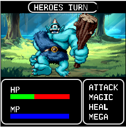

# MIPs (MARS) Turn-Based JRPG Game
Created by: Corey Carter
for CMPEN 351 (Penn State)

## Description:
I made a first-person RPG-game in the style of old Dragon Quest games of the 90’s with the main
character battling an enemy Orc. The player (hero) must fight an enemy orc and battle it
with their variety of abilities – these abilities include: attack, magic, heal and mega
attack. The game will end with either side wins the battle by making their opponent’s
HP zero.

## MARs Configuration:
### IMPORTANT: 
Use the Mars JAR located in the folder provided, otherwise the image loading won’t work due to file paths being based on the JARs location.

### Bitmap configurations are:
* Unit width: 1
* Unit Height: 1
* Display Width: 256
* Display Height: 256
* Base address: 0x10040000 (heap)

### Polled Keyboarding: 
You must load and input your commands into: "Keyboard and Display MMIO Simulator".

### Interface:
The game will be turned based RPG – meaning the player can only attack after the
enemy has. The order is randomized.

### When it’s the players turn, they will have Four options:
* A physical attack that will deal limited damage.
* A magic attack that will damage both the player and the Orc (both receive
damage, but the player receives less).
* A heal command that will heal the player by giving them a limited amount of
HP. It will cost the player a limited amount of MP.
* A Mega Attack will issue massive damage to the Orc – but will cost the user
large amounts of HP and MP.

The player gets one command per turn and there will be a time limit per turn for the
user.

Once the enemies HP goes to zero, the user wins – if the user’s HP goes to zero, then
the user loses.

